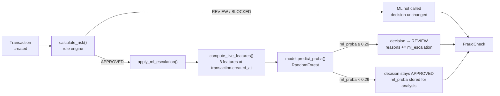

# Fraud Detection System

[](https://python.org)
[](https://djangoproject.com)
[](https://django-rest-framework.org)
[](LICENSE)


Rule-based engine (Django + DRF) vs RandomForest vs **hybrid (rules + ML escalation)** comparison on synthetic v5 data — 2000 accounts, 20000 transactions, 3% fraud rate, 6 fraud patterns. Demonstrates the trade-off between explainable rules and ML, with measurable gaps for each approach.

## Architecture



Key invariant: ML **never** lowers a rule decision — REVIEW and BLOCKED from `calculate_risk()` pass through unchanged. ML only escalates APPROVED → REVIEW when confidence exceeds the threshold (covered by [unit tests](fraud_checks/tests.py)).

## Results (test set, 4000 rows)

Hybrid applies ML only to APPROVED decisions; `ESCALATION_THRESHOLD = 0.29` tuned to maximise mule + balance_drain recall at <2% false positives on normal transactions.

| Pattern | Rules | ML (RF) | Hybrid | n_test |
|---|---|---|---|---|
| new_account_fraud | 85% (17/20) | 75% (15/20) | **100%** (20/20) | 20 |
| structuring_fraud | 78% (18/23) | 100% (23/23) | **100%** (23/23) | 23 |
| velocity_fraud | 70% (14/20) | 85% (17/20) | **95%** (19/20) | 20 |
| dormant_reactivation_fraud | 92% (11/12) | 58% (7/12) | **92%** (11/12) | 12 |
| mule_fraud | 22% (6/27) | 74% (20/27) | **81%** (22/27) | 27 |
| balance_drain_fraud | 0% (0/19) | 32% (6/19) | **74%** (14/19) | 19 |

Hybrid inherits the best of both: rules recall on dormant_reactivation (92%) and new_account (85% → 100% with ML escalation), while mule (22% → 81%) and balance_drain (0% → 74%) gain dramatically from ML at the lower threshold.

**Operational cost**: 57 of 3157 normal APPROVED transactions (1.81%) escalated to REVIEW at threshold 0.29. Zero regressions — hybrid never loses a fraud that rules caught (invariant enforced by design).

## Known limitations / honest findings

- **scikit-learn version sensitivity**[^sklearn]: ML recall (especially balance_drain) changes significantly between sklearn minor versions at identical code, data, and `random_state`. Version is pinned to `scikit-learn==1.9.0` in `requirements.txt` for reproducibility.

[^sklearn]: Under sklearn 1.8.0, the same pipeline yielded 11% balance_drain recall vs 32% at 1.9.0. The 1.8.0 result is not reproducible from this repository; shown here as an illustration of the sensitivity.

- **amount_to_balance_ratio distribution**: An early bug caused unrealistic ratios for normal transactions — values were too tight around 0.2-0.5, making fraud too easy to detect. The distribution was fixed in synthetic data generation (confirmed in EDA notebook). This was a closed issue, included here as a demonstration of iterative data quality engineering.

- **Train/test pattern imbalance**: Temporal clustering of fraud bursts caused uneven per-pattern splits (e.g., 5 balance_drain cases in test at v4). Fixed by adding per-transaction `day_jitter ∈ [0, 2]` days instead of a single burst offset, smoothing the chronological boundary.

## Reproducibility

Requires `scikit-learn==1.9.0` exactly — the table above is not reproducible under other minor versions (see limitations).

```bash
pip install -r requirements.txt
python -c "from ml.synthetic.export_dataset import export_dataset; export_dataset('v5')"
python ml/train_model.py
jupyter nbconvert --execute --to notebook --inplace ml/notebooks/eda_feature_distributions.ipynb
jupyter nbconvert --execute --to notebook --inplace ml/notebooks/rf_tuning.ipynb
jupyter nbconvert --execute --to notebook --inplace ml/notebooks/rules_vs_model_comparison.ipynb
# Tune escalation threshold:
#   python ml/tune_escalation_threshold.py
```

## Structure

```
fraud-detection-system/
├── config/              # Django settings, URLs, ASGI/WSGI
├── accounts/            # Account model, read-only API, migrations
├── transactions/        # Transaction model, POST/create API, signals
├── fraud_checks/        # Rule engine (services.py), FraudCheck model,
│                        #   ML escalation (apply_ml_escalation), tests
├── ml/
│   ├── synthetic/       # Data generation: config, distributions,
│   │                    #   generators (6 patterns), build_dataset,
│   │                    #   export_dataset, persist_to_db
│   ├── datasets/        # synthetic_v5.csv (gitignored)
│   ├── models/          # fraud_model_v5.pkl (gitignored)
│   ├── notebooks/       # EDA, RF tuning, rules-vs-ML comparison
│   ├── inference.py     # Live feature computation, predict_ml_proba
│   ├── train_model.py   # RF training + evaluation
│   └── tune_escalation_threshold.py  # Grid search for threshold
├── manage.py
├── requirements.txt     # scikit-learn==1.9.0 pinned
└── LICENSE
```
